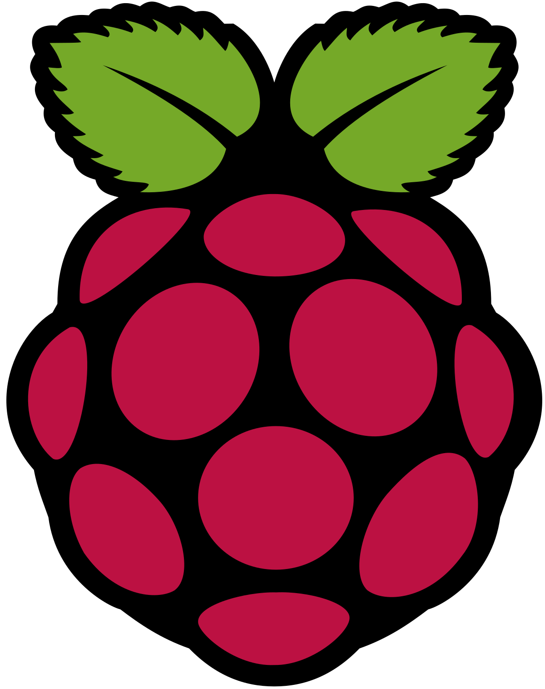

# 📚 My Raspberry Pi Projects

This repository contains all my current Raspberry-Pi projects. They will be ubdated continously.

  

## Programs
- LED Blink (blink_led)
- Camera Server (camera_server)
- Web controlled car (remoteCar)
- Web controlled car with live video footage (remoteCarCamera)
- Servo controller (servo)
- AI speech recognition app (mic)

